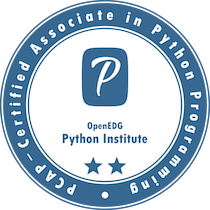
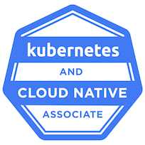
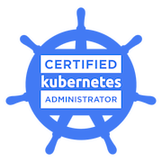

### Hi there 👋

**Stackoverflow** | **GitHub Stats** | **Recently Used Programming Languages**
--- | --- | ---
 |  | 

- 🔭 I’m currently working on R&D projects related to 5G and beyond as a Software Engineer. Mainly K8s DevOps and Goland and Python Backend, architecture design and implementation. Would love to work again in the Smart Energy sector.
- 🌱 I’m currently learning how SW products are evolved and released. 
- 👯 I’m looking to collaborate on OpenSource Projects regarding Smart and Clean Energy that need a Python/Golang/Devops programmer to build up communication infra, OOP on top of the data available etc 
- 📫 How to reach me: E-mail (guillermo.gc1994@gmail.com, linkdin, GitLab (I'm active there as well under the same username), even an issue in my guigomcha repository is OK.

## ⚡ Technologies

